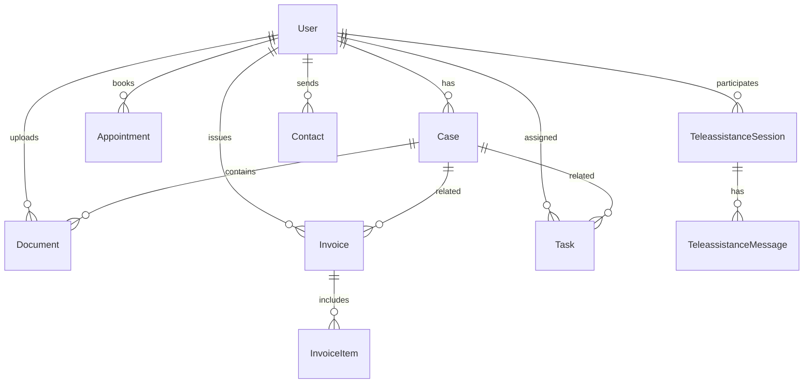

# 📚 Documentación para Desarrolladores

## Índice
- [Arquitectura General](#arquitectura-general)
- [Casos de Uso Principales](#casos-de-uso-principales)
- [Modelo de Datos (ERD)](#modelo-de-datos-erd)
- [Diagrama de Casos de Uso](#diagrama-de-casos-de-uso)
- [Especificación de Casos de Uso](#especificacion-de-casos-de-uso)
- [Guía para Subir a Notion](#guia-para-subir-a-notion)

---

## Arquitectura General

- **Frontend:** React + Vite (src/frontend)
- **Backend:** NestJS + Prisma (src/backend)
- **Base de datos:** PostgreSQL
- **Comunicación:** REST API + WebSocket (chat)
- **Autenticación:** JWT, roles (ADMIN, ABOGADO, CLIENTE)
- **Infraestructura:** Scripts de setup, migraciones Prisma, despliegue en Vercel/Heroku/Netlify

---

## Casos de Uso Principales

- **Gestión de usuarios y roles**
- **Gestión de casos legales**
- **Gestión de documentos**
- **Facturación electrónica**
- **Provisión de fondos**
- **Citas y agenda**
- **Chat en tiempo real**
- **Teleasistencia**
- **Panel de administración**
- **Parámetros y contenido legal**

---

## Modelo de Datos (ERD)



---

## Diagrama de Casos de Uso (Resumen)

```mermaid
%% Diagrama de casos de uso principal
%% (Puedes editarlo en Notion usando un plugin Mermaid)
%%
%% Abogado, Cliente, Administrador y sus casos de uso

%% Este es un ejemplo, puedes ampliarlo según tus necesidades

%% actor Abogado
%% actor Cliente
%% actor Administrador
%%
%% Abogado --> (Gestionar Casos)
%% Abogado --> (Enviar Mensaje Chat)
%% Abogado --> (Emitir Factura)
%% Abogado --> (Teleasistencia)
%% Cliente --> (Consultar Casos)
%% Cliente --> (Enviar Mensaje Chat)
%% Cliente --> (Solicitar Teleasistencia)
%% Administrador --> (Configurar Parámetros)
%% Administrador --> (Gestionar Usuarios)
%% Administrador --> (Ver Reportes)
```

---

## Especificación de Casos de Uso

### 1. **Gestión de Casos**
- **Actor:** Abogado, Cliente
- **Flujo principal:**
  1. El usuario inicia sesión.
  2. Accede a la sección de casos.
  3. Puede crear, ver, editar o cerrar un caso (según rol).
  4. Puede asociar documentos y tareas al caso.

### 2. **Chat en Tiempo Real**
- **Actor:** Abogado, Cliente
- **Flujo principal:**
  1. El usuario abre el widget de chat.
  2. Selecciona una conversación o inicia una nueva.
  3. Envía y recibe mensajes en tiempo real.
  4. Puede cerrar o reiniciar la conversación.

### 3. **Facturación Electrónica**
- **Actor:** Abogado
- **Flujo principal:**
  1. El abogado accede a la sección de facturación.
  2. Genera una nueva factura asociada a un caso.
  3. Descarga el XML/PDF y lo envía al cliente.

### 4. **Teleasistencia**
- **Actor:** Abogado, Cliente
- **Flujo principal:**
  1. El cliente solicita teleasistencia.
  2. El abogado acepta y se inicia la sesión remota.
  3. Se registra el historial y se pueden dejar notas.

### 5. **Panel de Administración**
- **Actor:** Administrador
- **Flujo principal:**
  1. Accede al panel admin.
  2. Gestiona usuarios, parámetros, menús y reportes.

---

## Guía para Subir la Documentación a Notion

1. **Copia el contenido de este archivo** (`DESARROLLADORES.md`).
2. **Abre Notion** y crea una nueva página.
3. **Pega el contenido**. Notion soporta Markdown y puedes usar plugins para visualizar Mermaid.
4. **Para los diagramas Mermaid:**
   - Usa el bloque `/code` y selecciona `mermaid` como lenguaje.
   - O instala una extensión como "Notion Enhancer" o "Notion Mermaid" para renderizar los diagramas.
5. **Organiza la documentación** usando los encabezados y tablas de contenido de Notion.

---

**¡Listo! Ahora tienes una base profesional para desarrolladores y puedes ampliarla según tus necesidades.** 