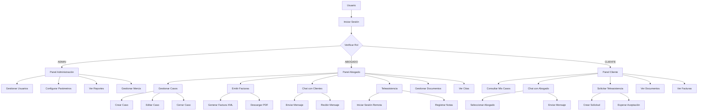
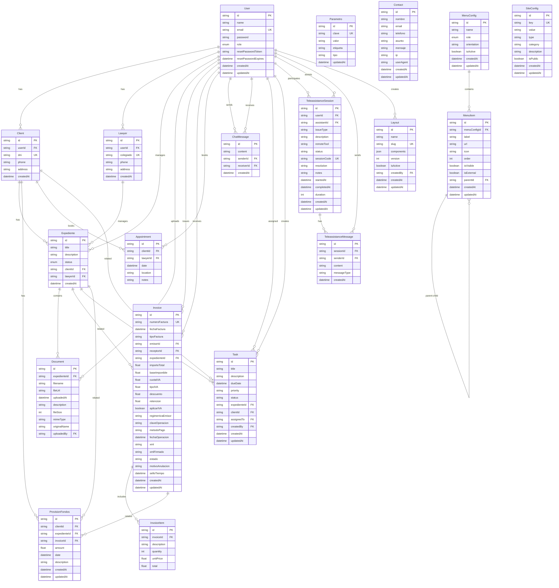
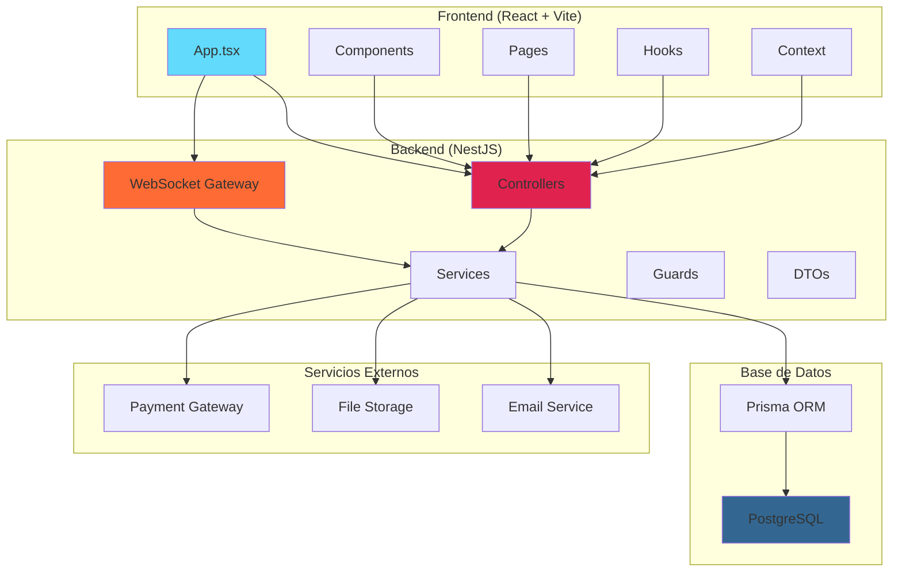
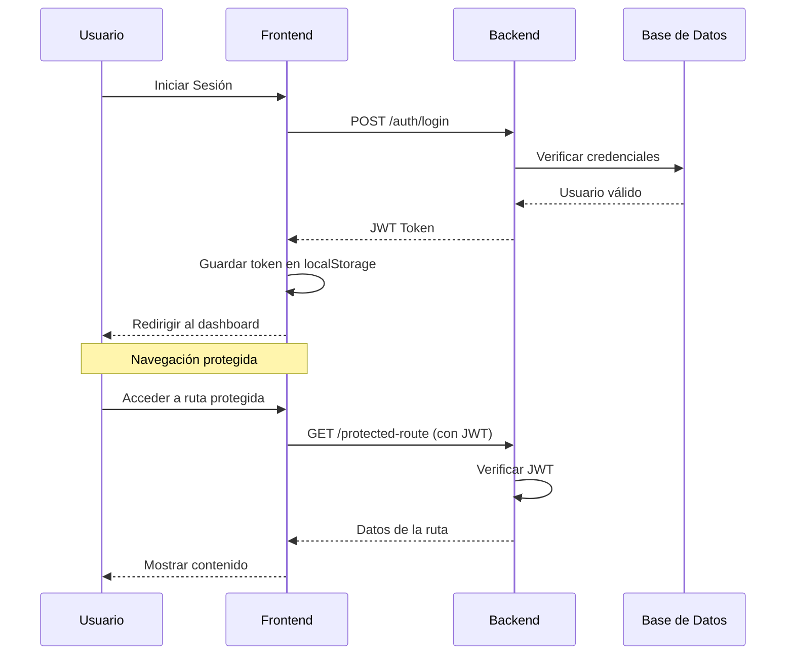
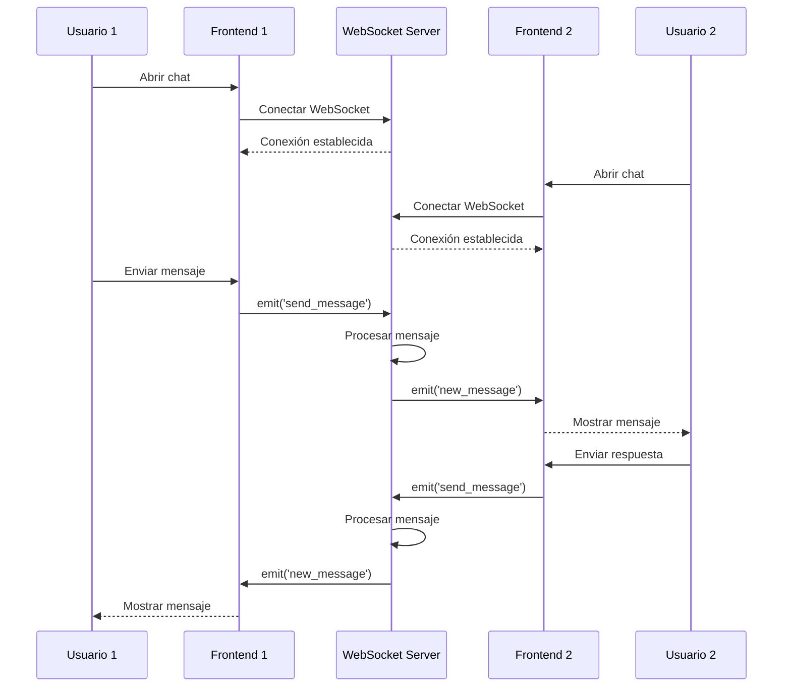

# 📊 Diagramas Mermaid para Notion

## Diagrama de Casos de Uso



## Modelo de Datos (ERD)



## Diagrama de Arquitectura del Sistema



## Diagrama de Flujo de Autenticación



## Diagrama de Flujo de Chat en Tiempo Real



---

## Instrucciones para usar en Notion:

1. **Copia el bloque de código** que empieza con ```mermaid
2. **En Notion**, escribe `/code` y selecciona el bloque Code
3. **Pega el código** y cambia el lenguaje a `mermaid`
4. **Instala una extensión** como "Notion Enhancer" para ver los diagramas renderizados

---

**¡Listo! Ahora tienes todos los diagramas principales listos para copiar y pegar en Notion.** 