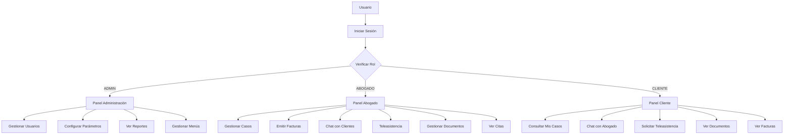
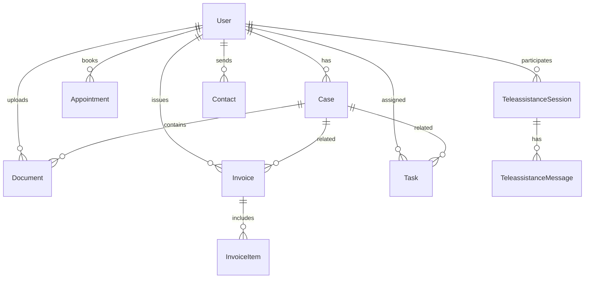
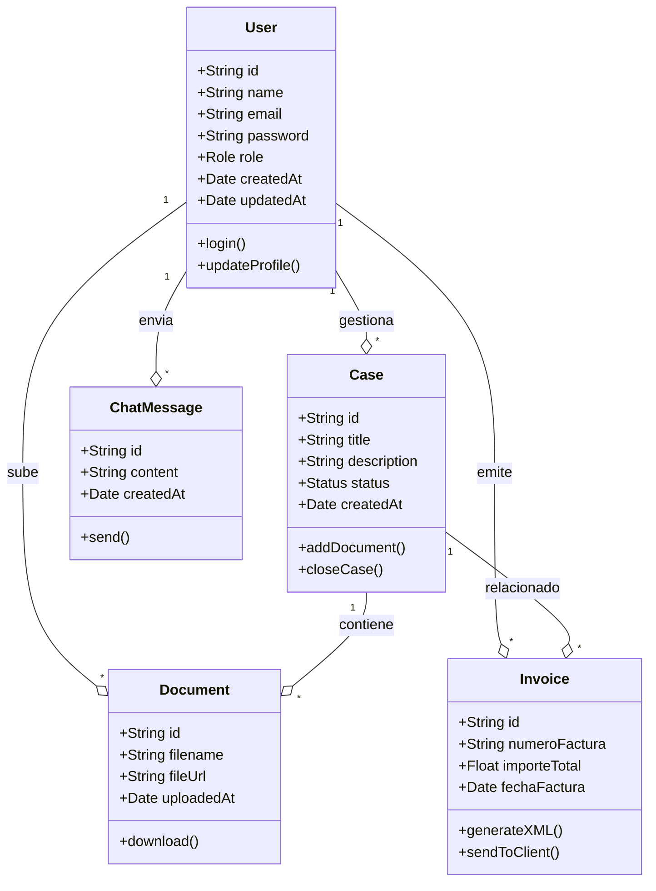
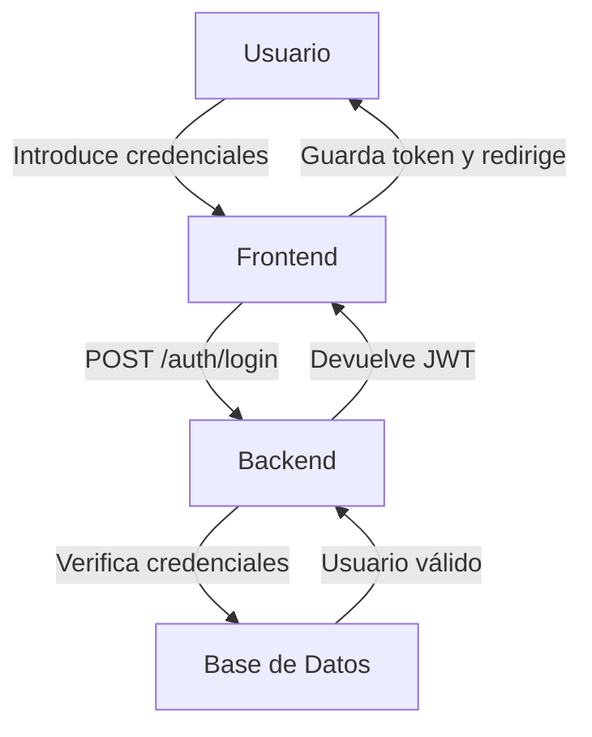
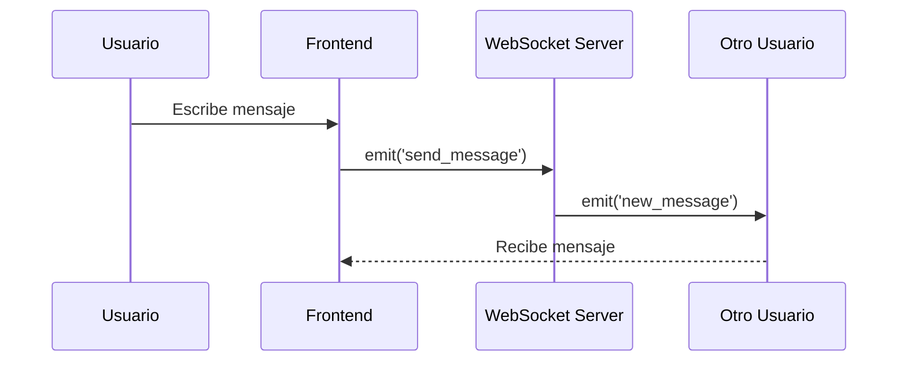
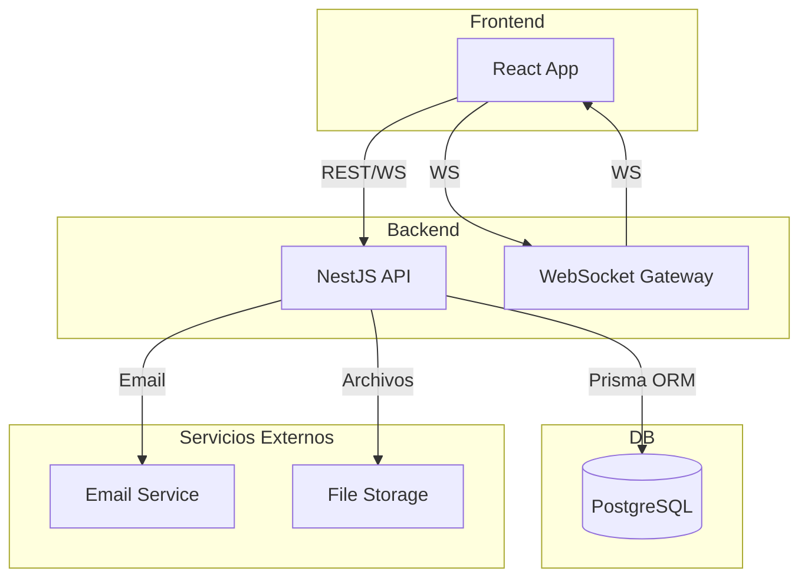
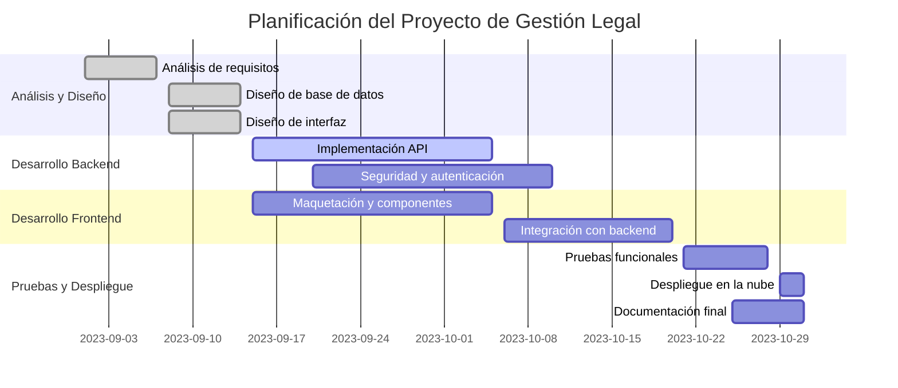

# Proyecto de DAW: Sistema Integral de Gestión Legal

## 1. Portada
- **Nombre del módulo:** Proyecto de DAW
- **Título:** Sistema Integral de Gestión Legal para Despachos y Abogados
- **Autor:** [Nombre Apellido] - [DNI]
- **Fecha:** [Fecha de entrega]
- **Curso académico:** 2023/2024

---

## 2. Índice
- 1 Portada
- 2 Índice
- 3 Resumen
- 4 Palabras clave
- 5 Introducción
- 6 Objetivos
- 7 Análisis del contexto
  - 7.1 Análisis del contexto
  - 7.2 Innovación
- 8 Diseño
  - 8.1 Diseño de la interfaz
  - 8.2 Casos de uso de los usuarios
  - 8.3 Modelo de datos
  - 8.4 Diagrama de Clases
  - 8.5 Despliegue
  - 8.6 Guía de navegación
  - 8.7 Guía de estilos
  - 8.8 Diagramas de flujo, secuencia y arquitectura
- 9 Planificación
  - 9.1 Diagrama de Gantt
- 10 Puesta en marcha, explotación
- 11 Prueba y control de calidad
- 12 Gestión económica o plan de empresa
  - 12.1 Sector productivo
  - 12.2 La empresa
  - 12.3 El producto o servicio
- 13 Conclusiones y valoración personal
- 14 Bibliografía

---

## 3. Resumen
El presente proyecto consiste en el desarrollo e implantación de una plataforma integral de gestión legal orientada a despachos de abogados, consultoras y clientes. La solución permite la gestión de casos, documentos, facturación electrónica, teleasistencia y comunicación en tiempo real, todo ello cumpliendo con la normativa vigente de protección de datos y accesibilidad. El sistema destaca por su modularidad, escalabilidad y facilidad de despliegue en la nube, aportando innovación en la digitalización del sector legal y facilitando la colaboración entre profesionales y clientes.

---

## 4. Palabras clave
- Gestión legal
- Despacho de abogados
- Facturación electrónica
- Teleasistencia
- Chat en tiempo real
- NestJS
- React
- PostgreSQL
- SaaS legal
- Accesibilidad
- Seguridad
- Cloud

---

## 5. Introducción
En la actualidad, la digitalización de los procesos legales es una necesidad creciente en despachos y consultoras jurídicas. Observando la falta de soluciones integrales, seguras y adaptables para la gestión de casos, documentos y comunicación con clientes, surge la idea de este proyecto. El objetivo es ofrecer una herramienta moderna, accesible y fácil de desplegar, que permita a los profesionales del derecho optimizar su trabajo diario, mejorar la atención al cliente y cumplir con los requisitos legales y de seguridad. El proyecto se plantea como una solución adaptable tanto para empresas como para profesionales independientes.

---

## 6. Objetivos
**Objetivo general:**  
Desarrollar una plataforma web integral para la gestión legal, que cubra todas las necesidades de un despacho moderno.

**Objetivos específicos:**
- Gestionar usuarios y roles con seguridad.
- Permitir la gestión completa de casos y documentos.
- Integrar facturación electrónica y provisión de fondos.
- Facilitar la comunicación mediante chat y teleasistencia.
- Cumplir con la normativa de privacidad y accesibilidad.
- Permitir el despliegue en servidores cloud gratuitos.

---

## 7. Análisis del contexto
### 7.1 Análisis del contexto
**Competencia:**
- **Clio, Quolaw, Sudespacho.net, Rocket Lawyer**: Plataformas SaaS para gestión legal.
- **Usuarios:** Despachos, abogados independientes, consultoras.
- **Características:** Gestión de expedientes, facturación, agenda, comunicación.
- **Ventajas:** Integración, soporte, experiencia de usuario.
- **Desventajas:** Coste elevado, poca personalización, dependencia de proveedor.
- **Precio:** Entre 30 y 100 €/mes por usuario.

**Análisis DAFO:**
- **Fortalezas:** Modularidad, open source, despliegue gratuito, cumplimiento legal.
- **Debilidades:** Menor soporte comercial, requiere conocimientos técnicos para despliegue.
- **Oportunidades:** Digitalización del sector legal, demanda de soluciones cloud.
- **Amenazas:** Competencia consolidada, cambios normativos.

### 7.2 Innovación
- **Aporta:** Solución open source, personalizable, fácil de desplegar y mantener.
- **Mejora:** Eficiencia en la gestión, comunicación y facturación.
- **Cambio de paradigma:** Democratiza el acceso a tecnología legal avanzada.
- **Soluciones innovadoras:** Integración de chat y teleasistencia, scripts de setup, arquitectura desacoplada, cumplimiento legal editable desde panel.

---

## 8. Diseño
### 8.1 Diseño de la interfaz
A continuación se muestran ejemplos de las principales pantallas de la aplicación:

- **Pantalla de Login:**
  
  - Permite el acceso seguro de usuarios registrados.

- **Dashboard:**
  
  - Vista general de casos, tareas y notificaciones.

- **Gestión de Casos:**
  
  - Listado, creación y edición de casos legales.

- **Chat en tiempo real:**
  
  - Comunicación instantánea entre usuarios.

- **Teleasistencia:**
  
  - Solicitud y gestión de sesiones remotas.

*(Las imágenes son ejemplos, sustituir por capturas reales del sistema.)*

### 8.2 Casos de uso de los usuarios
- **Acceso público:** Consulta de información legal, contacto.
- **Usuarios registrados:** Gestión de casos, documentos, chat, facturación.
- **Administradores:** Gestión de usuarios, parámetros, reportes.

#### Diagrama de Casos de Uso (Mermaid)

### 8.3 Modelo de datos
#### Diagrama ERD (Mermaid)

### 8.4 Diagrama de Clases

Ejemplo de diagrama de clases (Mermaid):

### 8.5 Despliegue
- **Dónde:** Heroku, Railway, Vercel, Netlify (gratuitos)
- **Herramientas:** Docker (opcional), scripts de setup, migraciones Prisma.
- **Costes:** Gratuito en modalidad básica.
- **Mantenimiento:** Actualizaciones automáticas, backup manual o con scripts.

### 8.6 Guía de navegación
- **Inicio:** Acceso a login o registro.
- **Dashboard:** Vista general tras login.
- **Menú lateral:** Acceso a casos, documentos, facturación, chat, teleasistencia, administración.
- **Panel de administración:** Gestión de usuarios, parámetros, reportes.
- **Botón de ayuda:** Acceso a documentación y soporte.

### 8.7 Guía de estilos
- **Colores principales:**
  - Azul (#2563eb), blanco, gris claro.
- **Tipografía:**
  - Inter, Arial, sans-serif.
- **Botones:**
  - Bordes redondeados, colores de estado (azul, verde, rojo).
- **Iconografía:**
  - Heroicons, FontAwesome.
- **Diseño responsive:**
  - Adaptado a móvil, tablet y escritorio.
- **Accesibilidad:**
  - Contraste alto, navegación por teclado, etiquetas ARIA.

### 8.8 Diagramas de flujo, secuencia y arquitectura

#### Diagrama de Flujo de Autenticación

#### Diagrama de Secuencia: Envío de Mensaje en el Chat

#### Diagrama de Arquitectura del Sistema

---

## 9. Planificación
- **Actividades:** Análisis, diseño, desarrollo backend, desarrollo frontend, integración, pruebas, despliegue, documentación.
- **Recursos:** PC, conexión a Internet, cuentas en Heroku/Vercel, IDE, Prisma, Node.js, PostgreSQL.
- **Riesgos:** Cambios de requisitos, problemas de despliegue, seguridad.
- **Costes:** 0€ (infraestructura gratuita).

### 9.1 Diagrama de Gantt

Ejemplo de diagrama de Gantt (Mermaid):

---

## 10. Puesta en marcha, explotación
- **Cambios de configuración:** Ajuste de variables de entorno, configuración de seguridad JWT, CORS, HTTPS.
- **Legalidad:** Revisión de textos legales, cumplimiento RGPD.
- **Pasos a producción:** Pruebas finales, backup, despliegue en cloud, verificación de endpoints.

---

## 11. Prueba y control de calidad
- **Plan de pruebas:** Pruebas unitarias, integración, usabilidad, accesibilidad, seguridad.
- **Entradas:** Datos de ejemplo, usuarios de prueba.
- **Salidas:** Resultados esperados vs. obtenidos.
- **Resultado:** Validación de funcionalidades y requisitos.

---

## 12. Gestión económica o plan de empresa
### 12.1 Sector productivo
- **Sector:** TIC, LegalTech, SaaS.
- **Empresas:** Miles en España, desde startups a grandes consultoras.
- **Características:** Innovación, digitalización, servicios cloud, cumplimiento legal.

### 12.2 La empresa
- **Forma jurídica:** Sociedad limitada (S.L.) por flexibilidad y responsabilidad limitada.
- **Ventajas:** Facilidad de constitución, protección patrimonial.
- **Trámites:** Alta en Hacienda, Registro Mercantil, Seguridad Social, Ayuntamiento, SEPE, Inspección de Trabajo.
- **Organigrama:** CEO, CTO, desarrollador, soporte.
- **Convenio colectivo:** Consultar buscador oficial.
- **Prevención de riesgos:** Seguridad informática, ergonomía, teletrabajo.

### 12.3 El producto o servicio
- **Descripción:** Plataforma web para gestión legal integral.
- **Características técnicas:** NestJS, React, PostgreSQL, WebSocket, scripts de setup.
- **Funciones básicas:** Gestión de casos, documentos, facturación, chat, teleasistencia, administración.
- **Tecnología:** Open source, cloud, responsive, accesible.
- **Necesidades cubiertas:** Digitalización, eficiencia, cumplimiento legal.
- **Innovación:** Integración de chat y teleasistencia, personalización, despliegue gratuito.

---

## 13. Conclusiones y valoración personal
*(Redacta tu valoración personal, utilidad de las FCTs, consejos de tutores, tareas realizadas, etc.)*

---

## 14. Bibliografía
- [NestJS](https://nestjs.com/)
- [React](https://react.dev/)
- [Prisma ORM](https://www.prisma.io/)
- [Heroku](https://heroku.com/)
- [Vercel](https://vercel.com/)
- [InformeTIC](https://www.mineco.gob.es/stfls/mineco/ministerio/ficheros/libreria/InformeTIC.pdf)
- [ipYME](http://www.ipyme.org/)
- [Canva Organigramas](https://www.canva.com/es_es/graficos/organigrama/)
- [Buscador Convenios](https://expinterweb.mitramiss.gob.es/mapas/consultaAvanzada)

---

**DOCUMENTACIÓN A ENTREGAR**  
*Guarda este archivo como `documentacion/proyecto/DOCUMENTACION_A_ENTREGAR.md` y adjunta los diagramas y capturas necesarias en la misma carpeta.* 