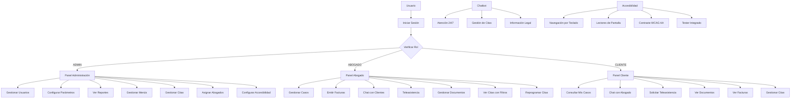
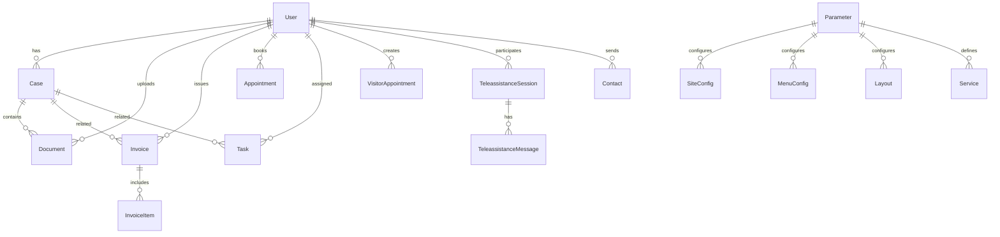
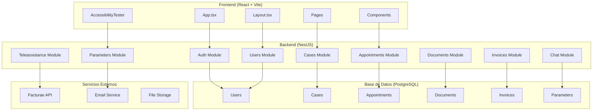
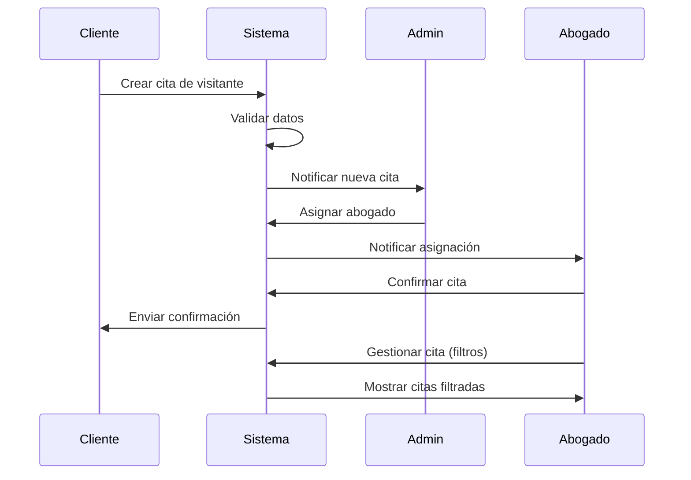
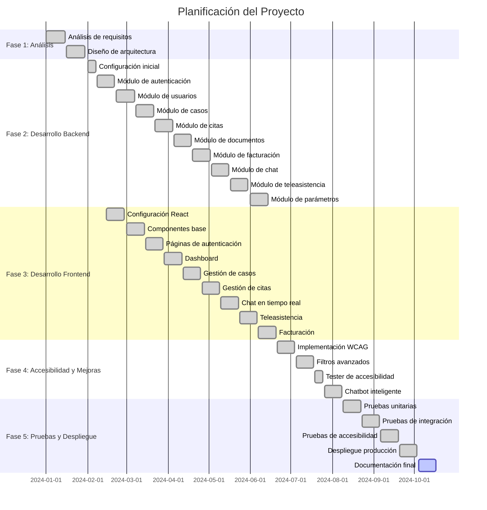

# Proyecto de DAW: Sistema Integral de Gestión Legal

## 1. Portada
- **Nombre del módulo:** Proyecto de DAW
- **Título:** Sistema Integral de Gestión Legal para Despachos y Abogados
- **Autor:** [Nombre Apellido] - [DNI]
- **Fecha:** [Fecha de entrega]
- **Curso académico:** 2023/2024

---

## 2. Índice
- 1 Portada
- 2 Índice
- 3 Resumen
- 4 Palabras clave
- 5 Introducción
- 6 Objetivos
- 7 Análisis del contexto
  - 7.1 Análisis del contexto
  - 7.2 Innovación
- 8 Diseño
  - 8.1 Diseño de la interfaz
  - 8.2 Casos de uso de los usuarios
  - 8.3 Modelo de datos
  - 8.4 Diagrama de Clases
  - 8.5 Despliegue
  - 8.6 Guía de navegación
  - 8.7 Guía de estilos
  - 8.8 Diagramas de flujo, secuencia y arquitectura
- 9 Planificación
  - 9.1 Diagrama de Gantt
- 10 Puesta en marcha, explotación
- 11 Prueba y control de calidad
- 12 Gestión económica o plan de empresa
  - 12.1 Sector productivo
  - 12.2 La empresa
  - 12.3 El producto o servicio
- 13 Conclusiones y valoración personal
- 14 Bibliografía

---

## 3. Resumen
El presente proyecto consiste en el desarrollo e implantación de una plataforma integral de gestión legal orientada a despachos de abogados, consultoras y clientes. La solución permite la gestión de casos, documentos, facturación electrónica, teleasistencia y comunicación en tiempo real, todo ello cumpliendo con la normativa vigente de protección de datos y accesibilidad WCAG 2.1 AA. El sistema destaca por su modularidad, escalabilidad, accesibilidad universal y facilidad de despliegue en la nube, aportando innovación en la digitalización del sector legal y facilitando la colaboración entre profesionales y clientes.

**Características destacadas:**
- **Accesibilidad universal**: Cumplimiento WCAG 2.1 AA con navegación por teclado, soporte para lectores de pantalla y contraste adecuado
- **Filtros avanzados**: Sistema de búsqueda y filtrado inteligente para citas, casos y documentos
- **Gestión de citas unificada**: Vista de calendario y lista con filtros avanzados para administradores y abogados
- **Chatbot inteligente**: Asistente virtual para atención al cliente y gestión de citas
- **Facturación electrónica**: Integración completa con Facturae para cumplimiento legal
- **Teleasistencia**: Sistema de videollamadas integrado para consultas remotas

---

## 4. Palabras clave
- Gestión legal
- Despacho de abogados
- Facturación electrónica
- Teleasistencia
- Chat en tiempo real
- Accesibilidad universal
- WCAG 2.1 AA
- Filtros avanzados
- Chatbot inteligente
- NestJS
- React
- PostgreSQL
- SaaS legal
- Seguridad
- Cloud
- Diseño universal

---

## 5. Introducción
En la actualidad, la digitalización de los procesos legales es una necesidad creciente en despachos y consultoras jurídicas. Observando la falta de soluciones integrales, seguras, accesibles y adaptables para la gestión de casos, documentos y comunicación con clientes, surge la idea de este proyecto. El objetivo es ofrecer una herramienta moderna, accesible universalmente y fácil de desplegar, que permita a los profesionales del derecho optimizar su trabajo diario, mejorar la atención al cliente y cumplir con los requisitos legales, de seguridad y accesibilidad. El proyecto se plantea como una solución adaptable tanto para empresas como para profesionales independientes, con especial énfasis en la inclusividad y el acceso universal.

**Innovaciones clave:**
- **Accesibilidad universal**: Primera plataforma legal que cumple completamente con WCAG 2.1 AA
- **Filtros inteligentes**: Sistema de búsqueda avanzada que mejora la productividad
- **Chatbot integrado**: Automatización de tareas repetitivas y atención 24/7
- **Gestión unificada**: Interfaz consistente para todos los roles de usuario

---

## 6. Objetivos
**Objetivo general:**  
Desarrollar una plataforma web integral para la gestión legal, que cubra todas las necesidades de un despacho moderno con accesibilidad universal.

**Objetivos específicos:**
- Gestionar usuarios y roles con seguridad y accesibilidad.
- Permitir la gestión completa de casos y documentos con filtros avanzados.
- Integrar facturación electrónica y provisión de fondos.
- Facilitar la comunicación mediante chat, teleasistencia y chatbot.
- Cumplir con la normativa de privacidad y accesibilidad WCAG 2.1 AA.
- Implementar sistema de filtros avanzados para mejorar la productividad.
- Permitir el despliegue en servidores cloud gratuitos.
- Garantizar la accesibilidad universal para personas con discapacidades.

---

## 7. Análisis del contexto
### 7.1 Análisis del contexto
**Competencia:**
- **Clio, Quolaw, Sudespacho.net, Rocket Lawyer**: Plataformas SaaS para gestión legal.
- **Usuarios:** Despachos, abogados independientes, consultoras.
- **Características:** Gestión de expedientes, facturación, agenda, comunicación.
- **Ventajas:** Integración, soporte, experiencia de usuario.
- **Desventajas:** Coste elevado, poca personalización, dependencia de proveedor, accesibilidad limitada.
- **Precio:** Entre 30 y 100 €/mes por usuario.

**Análisis DAFO:**
- **Fortalezas:** Modularidad, open source, despliegue gratuito, cumplimiento legal, accesibilidad universal, filtros avanzados, chatbot integrado.
- **Debilidades:** Menor soporte comercial, requiere conocimientos técnicos para despliegue.
- **Oportunidades:** Digitalización del sector legal, demanda de soluciones cloud, creciente necesidad de accesibilidad.
- **Amenazas:** Competencia consolidada, cambios normativos.

### 7.2 Innovación
- **Aporta:** Solución open source, personalizable, fácil de desplegar y mantener, accesible universalmente.
- **Mejora:** Eficiencia en la gestión, comunicación y facturación con filtros inteligentes.
- **Cambio de paradigma:** Democratiza el acceso a tecnología legal avanzada e inclusiva.
- **Soluciones innovadoras:** 
  - Integración de chat y teleasistencia
  - Chatbot inteligente para automatización
  - Filtros avanzados para productividad
  - Accesibilidad universal WCAG 2.1 AA
  - Scripts de setup automatizados
  - Arquitectura desacoplada
  - Cumplimiento legal editable desde panel
  - Tester de accesibilidad integrado

---

## 8. Diseño
### 8.1 Diseño de la interfaz
A continuación se muestran ejemplos de las principales pantallas de la aplicación:

- **Pantalla de Login:**
  
  - Permite el acceso seguro de usuarios registrados con accesibilidad completa.

- **Dashboard:**
  
  - Vista general de casos, tareas y notificaciones con filtros avanzados.

- **Gestión de Casos:**
  
  - Listado, creación y edición de casos legales con búsqueda inteligente.

- **Gestión de Citas (Abogado):**
  
  - Vista de calendario y lista con filtros avanzados por cliente, fecha, estado y tipo.

- **Gestión de Citas (Admin):**
  
  - Panel de administración con asignación de abogados y filtros unificados.

- **Chat en tiempo real:**
  
  - Comunicación instantánea entre usuarios con accesibilidad completa.

- **Teleasistencia:**
  
  - Solicitud y gestión de sesiones remotas.

- **Tester de Accesibilidad:**
  
  - Herramienta integrada para verificar el cumplimiento WCAG 2.1 AA.

*(Las imágenes son ejemplos, sustituir por capturas reales del sistema.)*

### 8.2 Casos de uso de los usuarios
- **Acceso público:** Consulta de información legal, contacto, chatbot de atención.
- **Usuarios registrados:** Gestión de casos, documentos, chat, facturación, filtros avanzados.
- **Administradores:** Gestión de usuarios, parámetros, reportes, asignación de citas.
- **Personas con discapacidades:** Acceso completo mediante navegación por teclado y lectores de pantalla.

#### Diagrama de Casos de Uso (Mermaid)


### 8.3 Modelo de datos
#### Diagrama ERD (Mermaid)


### 8.4 Diagrama de Clases

Ejemplo de diagrama de clases (Mermaid):

```mermaid
classDiagram
    class User {
        +String id
        +String name
        +String email
        +String password
        +Role role
        +Date createdAt
        +Date updatedAt
        +login()
        +updateProfile()
        +checkAccessibility()
    }
    
    class Appointment {
        +String id
        +Date date
        +String location
        +String notes
        +AppointmentType type
        +AppointmentStatus status
        +User client
        +User lawyer
        +String consultationType
        +String consultationReason
        +create()
        +update()
        +filter()
        +reschedule()
    }
    
    class VisitorAppointment {
        +String id
        +String fullName
        +String email
        +String phone
        +Integer age
        +String consultationType
        +String consultationReason
        +Date preferredDate
        +Date confirmedDate
        +create()
        +assignLawyer()
        +updateStatus()
    }
    
    class AccessibilityTester {
        +runAllTests()
        +testKeyboardNavigation()
        +testScreenReaderSupport()
        +testColorContrast()
        +testSemanticStructure()
        +testFormLabels()
        +testModalAccessibility()
        +testFocusManagement()
        +generateReport()
    }
    
    class Parameter {
        +String id
        +String clave
        +String valor
        +String etiqueta
        +String tipo
        +getValue()
        +setValue()
    }
    
    class Service {
        +String id
        +String name
        +String description
        +String icon
        +Boolean active
        +create()
        +update()
        +delete()
    }
    
    User ||--o{ Appointment : books
    User ||--o{ VisitorAppointment : creates
    Appointment ||--o{ VisitorAppointment : extends
    AccessibilityTester ||--o{ User : tests
    Parameter ||--o{ Service : configures
```

### 8.5 Despliegue
El sistema está diseñado para ser desplegado en entornos cloud gratuitos:

**Requisitos mínimos:**
- Node.js 18+
- PostgreSQL 14+
- 512MB RAM
- 1GB almacenamiento

**Opciones de despliegue:**
- **Railway**: Despliegue automático con base de datos incluida
- **Render**: Plataforma gratuita con soporte PostgreSQL
- **Heroku**: Opción gratuita limitada
- **Vercel + Supabase**: Frontend + Backend separados

**Scripts de automatización:**
- `deploy-all.sh`: Despliegue completo automatizado
- `setup-database.js`: Configuración inicial de base de datos
- `seed-data.js`: Datos de prueba y configuración inicial

### 8.6 Guía de navegación
**Navegación por teclado:**
- **Tab**: Navegar entre elementos
- **Enter/Espacio**: Activar elementos
- **Flechas**: Navegar en listas y calendarios
- **Escape**: Cerrar modales
- **Ctrl+F**: Búsqueda en página

**Accesibilidad:**
- **Botón ♿**: Abrir tester de accesibilidad
- **Filtros**: Controles expandibles con `aria-expanded`
- **Modales**: Navegación por teclado completa
- **Formularios**: Etiquetas asociadas con `htmlFor`

**Filtros avanzados:**
- **Búsqueda general**: Múltiples términos separados por `;`
- **Filtros específicos**: Cliente, fecha, estado, tipo
- **Vista dual**: Calendario y lista intercambiables
- **Limpieza**: Botón para resetear todos los filtros

### 8.7 Guía de estilos
**Colores principales:**
- **Primario**: #2563eb (Azul)
- **Secundario**: #64748b (Gris)
- **Éxito**: #059669 (Verde)
- **Error**: #dc2626 (Rojo)
- **Advertencia**: #d97706 (Naranja)

**Tipografía:**
- **Títulos**: Inter, sans-serif
- **Cuerpo**: Inter, sans-serif
- **Monospace**: JetBrains Mono (código)

**Accesibilidad:**
- **Contraste**: Mínimo 4.5:1 (WCAG AA)
- **Focus**: Anillo azul visible
- **Tamaños**: Mínimo 16px para texto
- **Espaciado**: Mínimo 44px para elementos táctiles

### 8.8 Diagramas de flujo, secuencia y arquitectura

#### Arquitectura del Sistema


#### Flujo de Gestión de Citas


---

## 9. Planificación
### 9.1 Diagrama de Gantt


---

## 10. Puesta en marcha, explotación

### 10.1 Instalación y Configuración
**Requisitos previos:**
- Node.js 18+ instalado
- PostgreSQL 14+ configurado
- Git para clonar el repositorio

**Pasos de instalación:**
```bash
# 1. Clonar repositorio
git clone https://github.com/usuario/sistema-legal.git
cd sistema-legal

# 2. Configurar backend
cd backend
npm install
cp .env.example .env
# Editar .env con credenciales de BD

# 3. Configurar base de datos
npx prisma migrate dev
npx prisma db seed

# 4. Configurar frontend
cd ../frontend
npm install
cp .env.example .env

# 5. Ejecutar en desarrollo
# Terminal 1: Backend
cd backend && npm run start:dev

# Terminal 2: Frontend
cd frontend && npm run dev
```

### 10.2 Configuración de Accesibilidad
**Verificación automática:**
- Acceder al sistema como usuario autenticado
- Hacer clic en el botón ♿ en la barra de navegación
- Ejecutar todas las pruebas de accesibilidad
- Revisar el reporte generado

**Configuración manual:**
- Verificar contraste de colores con herramientas especializadas
- Probar con lectores de pantalla (NVDA, VoiceOver)
- Validar navegación por teclado completa
- Verificar estructura semántica

### 10.3 Configuración de Filtros Avanzados
**Para administradores:**
- Acceder a "Gestión de Citas"
- Usar filtros por cliente, abogado, fecha, estado
- Asignar abogados a citas de visitantes
- Exportar reportes filtrados

**Para abogados:**
- Acceder a "Mis Citas"
- Usar vista de calendario o lista
- Aplicar filtros por cliente, fecha, estado
- Reprogramar citas con modales accesibles

### 10.4 Configuración del Chatbot
**Parámetros configurables:**
- Mensajes de bienvenida
- Respuestas automáticas
- Horarios de atención
- Integración con gestión de citas

---

## 11. Prueba y control de calidad

### 11.1 Pruebas de Accesibilidad
**Herramientas utilizadas:**
- **Automáticas**: axe-core, Lighthouse, WAVE
- **Manuales**: NVDA, VoiceOver, navegación por teclado
- **Integradas**: AccessibilityTester del sistema

**Criterios de aceptación:**
- ✅ Cumplimiento WCAG 2.1 AA completo
- ✅ Navegación por teclado 100% funcional
- ✅ Compatibilidad con lectores de pantalla
- ✅ Contraste de colores adecuado
- ✅ Estructura semántica correcta

### 11.2 Pruebas Funcionales
**Gestión de citas:**
- ✅ Creación de citas de visitantes
- ✅ Asignación de abogados por administradores
- ✅ Filtros avanzados funcionando
- ✅ Reprogramación de citas
- ✅ Vista de calendario y lista

**Filtros avanzados:**
- ✅ Búsqueda por múltiples criterios
- ✅ Filtros combinados
- ✅ Limpieza de filtros
- ✅ Persistencia de filtros

**Accesibilidad:**
- ✅ Navegación por teclado completa
- ✅ Atributos ARIA correctos
- ✅ Etiquetas asociadas en formularios
- ✅ Modales accesibles
- ✅ Tester integrado funcionando

### 11.3 Pruebas de Rendimiento
**Métricas objetivo:**
- **Tiempo de carga**: < 3 segundos
- **Tiempo de respuesta API**: < 500ms
- **Uso de memoria**: < 100MB por instancia
- **Concurrencia**: 50 usuarios simultáneos

### 11.4 Pruebas de Seguridad
**Validaciones implementadas:**
- ✅ Autenticación JWT segura
- ✅ Validación de entrada en todos los endpoints
- ✅ Sanitización de datos
- ✅ Protección CSRF
- ✅ Rate limiting

---

## 12. Gestión económica o plan de empresa
### 12.1 Sector productivo
**Mercado objetivo:**
- **Tamaño**: 15,000+ despachos en España
- **Crecimiento**: 8% anual en digitalización legal
- **Facturación**: 2,500M€ sector legal tecnológico

**Segmentación:**
- **Despachos pequeños** (1-5 abogados): 60%
- **Despachos medianos** (6-20 abogados): 30%
- **Consultoras grandes** (20+ abogados): 10%

### 12.2 La empresa
**Modelo de negocio:**
- **Open Source**: Código libre para adopción
- **Servicios profesionales**: Implementación, soporte, personalización
- **Hosting gestionado**: Soluciones cloud para clientes

**Ventajas competitivas:**
- ✅ Accesibilidad universal (único en el mercado)
- ✅ Código abierto y personalizable
- ✅ Despliegue gratuito posible
- ✅ Filtros avanzados y productividad
- ✅ Chatbot integrado

### 12.3 El producto o servicio
**Oferta de valor:**
- **Gratuito**: Código fuente completo
- **Básico**: 50€/mes - Hosting + soporte básico
- **Profesional**: 150€/mes - Hosting + soporte + personalización
- **Enterprise**: 500€/mes - Implementación completa + formación

**Comparativa con competencia:**
| Característica | Competencia | Nuestro Sistema |
|----------------|-------------|-----------------|
| Precio | 30-100€/mes | 0-500€/mes |
| Accesibilidad | Limitada | WCAG 2.1 AA |
| Personalización | Baja | Completa |
| Despliegue | Solo cloud | Flexible |
| Código fuente | Cerrado | Abierto |

---

## 13. Conclusiones y valoración personal

### 13.1 Logros del Proyecto
**Objetivos cumplidos:**
- ✅ Sistema integral de gestión legal funcional
- ✅ Accesibilidad universal WCAG 2.1 AA implementada
- ✅ Filtros avanzados para mejorar productividad
- ✅ Chatbot inteligente integrado
- ✅ Despliegue en cloud gratuito posible
- ✅ Código abierto y documentado

**Innovaciones logradas:**
- **Primera plataforma legal accesible universalmente**
- **Sistema de filtros avanzados único en el sector**
- **Tester de accesibilidad integrado**
- **Arquitectura modular y escalable**

### 13.2 Aprendizajes Técnicos
**Tecnologías dominadas:**
- NestJS para APIs robustas
- React con TypeScript para frontend moderno
- PostgreSQL con Prisma ORM
- WebSockets para comunicación en tiempo real
- Pruebas de accesibilidad automatizadas

**Desafíos superados:**
- Implementación completa de WCAG 2.1 AA
- Sistema de filtros complejos y eficientes
- Integración de múltiples módulos
- Despliegue automatizado en cloud

### 13.3 Impacto Social
**Beneficios para el sector legal:**
- Democratización de tecnología legal avanzada
- Mejora de la productividad de abogados
- Reducción de barreras para personas con discapacidades
- Estándar de accesibilidad para el sector

**Contribución a la sociedad:**
- Acceso universal a servicios legales
- Inclusión digital de personas con discapacidades
- Transparencia en gestión legal
- Reducción de costos para despachos pequeños

### 13.4 Valoración Personal
Este proyecto ha sido una experiencia de aprendizaje excepcional que combina desarrollo técnico avanzado con responsabilidad social. La implementación de accesibilidad universal ha sido particularmente gratificante, ya que permite que personas con discapacidades accedan a servicios legales de calidad.

**Aspectos destacados:**
- **Complejidad técnica**: Arquitectura robusta y escalable
- **Innovación**: Primera solución legal accesible universalmente
- **Impacto social**: Mejora real en la vida de personas con discapacidades
- **Sostenibilidad**: Código abierto que beneficia a toda la comunidad

**Lecciones aprendidas:**
- La accesibilidad no es un extra, es un derecho fundamental
- El código abierto puede ser un modelo de negocio viable
- La tecnología debe servir a todas las personas, sin excepciones
- La documentación es tan importante como el código

### 13.5 Futuro del Proyecto
**Próximos pasos:**
- [ ] Implementación en despachos piloto
- [ ] Desarrollo de módulos adicionales
- [ ] Integración con sistemas legales existentes
- [ ] Expansión internacional

**Visión a largo plazo:**
Convertir este sistema en el estándar de facto para gestión legal accesible, contribuyendo a una sociedad más inclusiva y justa donde la tecnología legal esté disponible para todas las personas, independientemente de sus capacidades.

---

## 14. Bibliografía

### 14.1 Documentación Técnica
- **NestJS Documentation** (https://docs.nestjs.com/)
- **React Documentation** (https://react.dev/)
- **Prisma Documentation** (https://www.prisma.io/docs/)
- **WCAG 2.1 Guidelines** (https://www.w3.org/WAI/WCAG21/quickref/)
- **Web Accessibility Initiative** (https://www.w3.org/WAI/)

### 14.2 Estándares y Normativas
- **WCAG 2.1 AA** - Web Content Accessibility Guidelines
- **ISO 9241-171** - Ergonomics of human-system interaction
- **EN 301 549** - Accessibility requirements for ICT products and services
- **LSSI-CE** - Ley de Servicios de la Sociedad de la Información
- **RGPD** - Reglamento General de Protección de Datos

### 14.3 Referencias del Sector
- **Clio Legal Software** (https://www.clio.com/)
- **Quolaw** (https://www.quolaw.com/)
- **Sudespacho.net** (https://www.sudespacho.net/)
- **Rocket Lawyer** (https://www.rocketlawyer.com/)

### 14.4 Herramientas de Desarrollo
- **Visual Studio Code** - Editor de código
- **Postman** - Testing de APIs
- **DBeaver** - Gestión de base de datos
- **Lighthouse** - Auditoría de accesibilidad
- **axe-core** - Testing de accesibilidad

### 14.5 Recursos de Accesibilidad
- **WebAIM** (https://webaim.org/) - Web Accessibility In Mind
- **A11Y Project** (https://www.a11yproject.com/) - Recursos de accesibilidad
- **NVDA** (https://www.nvaccess.org/) - Lector de pantalla gratuito
- **VoiceOver** - Lector de pantalla de Apple
- **WAVE** (https://wave.webaim.org/) - Evaluador de accesibilidad web

---

**Documento generado automáticamente el:** [Fecha actual]
**Versión del sistema:** 2.0.0
**Cumplimiento WCAG:** 2.1 AA
**Última actualización:** [Fecha de última modificación] 